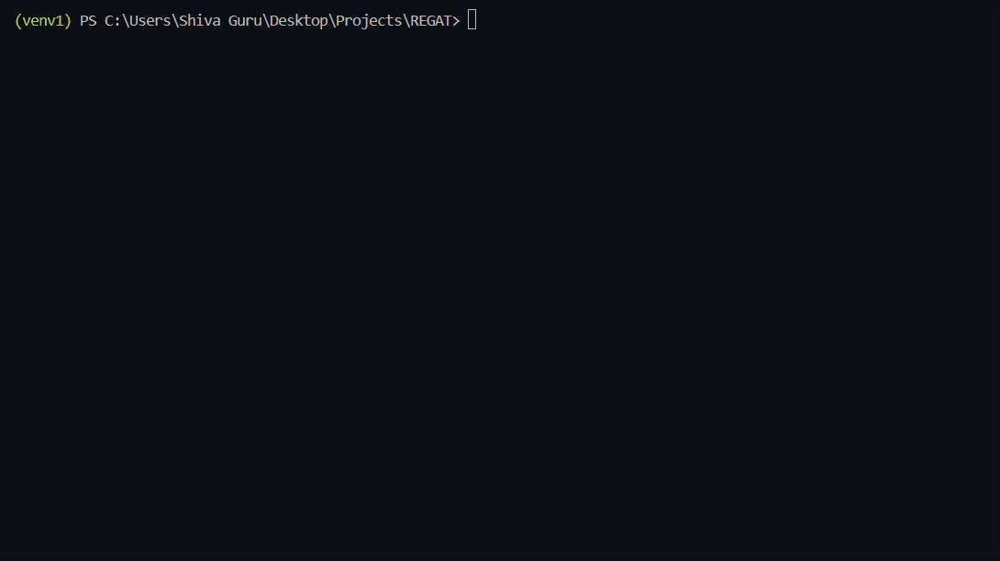

# REGAT – Reconnaissance Automation Tool

## Demo



REGAT is a Python-based CLI tool designed to automate **early-stage web application reconnaissance** for authorized security assessments. It consolidates multiple reconnaissance techniques into a unified workflow to identify exposed assets, misconfigurations, and attack surface indicators.

> ⚠️ This tool is intended for **authorized use only** in environments where explicit permission has been granted.

---

## Features

- Domain reconnaissance and reachability checks  
- Security header analysis  
- DNS enumeration (A, AAAA, MX, NS, TXT, CNAME)  
- robots.txt and sitemap.xml analysis  
- Multithreaded subdomain fuzzing  
- SSL/TLS certificate inspection  
- Endpoint discovery using customizable wordlists  
- Heuristic-based exposure scoring  
- Structured JSON report export  
- Installable CLI tool (`regat -h`)  

---

## Exposure Scoring

REGAT provides an exposure score based on:
- missing security controls
- reconnaissance findings
- misconfiguration indicators

## Custom Wordlists
Subdomain
REGAT supports user-provided wordlists:
```bash
regat example.com --wordlist custom_subdomains.txt
```
Endpoints
```bash
regat example.com --endpoint-wordlist custom_endpoints.txt
```
## Project Structure 
```bash
REGAT/
├── regat/
│   ├── cli.py
│   └── modules/
├── wordlists/
├── reports/
├── pyproject.toml
├── README.md
├── requirements.txt
```

## Ethical Use

This tool is intended for:

- authorized penetration testing
- defensive security research
- learning and portfolio development

⚠️ Do NOT use REGAT on:
- systems you do not own
- targets without explicit permission

## Future Enhancements
- Future Improvements
- Technology fingerprinting
- HTML report generation
- Screenshot capture
- Scan modes (quick/full/passive)
- Config file support
- Improved endpoint classification

## Installation

### 1. Clone the repository
```bash
git clone https://github.com/cybxrghoul/REGAT.git
cd REGAT
```

### 2. Create a virtual environment
Windows (Powershell):
```bash
python -m venv venv
venv\Scripts\Activate
```
Linux / macOS
```bash
python3 -m venv venv
source venv/bin/activate
```

### 3. Install the tool
```bash
pip install -e .
```
### 4. Usage
**Basic scan:**
```bash
regat example.com
```

**Custom thread count:**
```bash
regat example.com --threads 30
```

**Custom timeout:**
```bash 
regat example.com --timeout 3
```

**Custom subdomain wordlist:**
```bash
regat example.com --wordlist wordlists/subdomains.txt
```

**Custom endpoint wordlist:**
```bash
regat example.com --endpoint-wordlist wordlists/endpoints.txt
```

**JSON-only output:**
```bash
regat example.com --json-only
```

**Version check:**
```bash
regat --version
```

## Author
**Shri Shiva Guru**
Cybersecurity Enthusiast | Detection Engineering | AI Security
